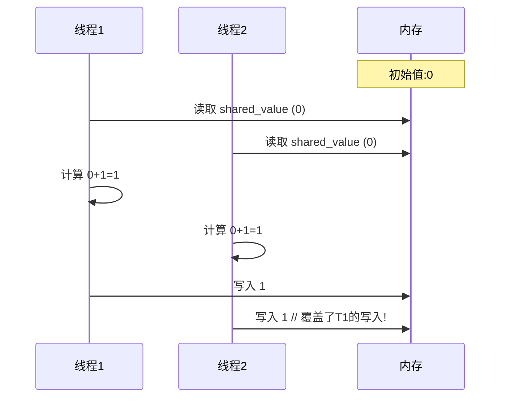
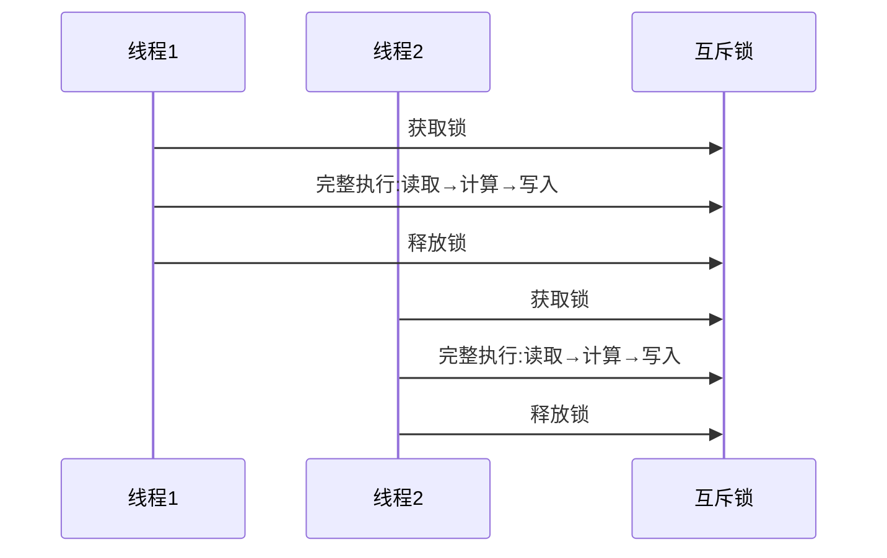

C++ 学习笔记

# 同步机制
### 同步机制详解

"没有同步机制时，不保证多线程操作顺序" 这句话是并发编程的核心原则。让我详细解释：

#### 什么是同步机制？

同步机制是用于协调多个线程执行顺序的工具或方法，确保线程以可预测的方式访问共享资源。主要类型包括：

1. **互斥锁 (Mutex)**
   ```cpp
   std::mutex mtx;
   mtx.lock();
   // 临界区 - 保证同一时间只有一个线程执行这段代码
   mtx.unlock();
   ```

2. **原子操作 (Atomic Operations)**
   ```cpp
   std::atomic<int> counter(0);
   counter.fetch_add(1, std::memory_order_relaxed); // 线程安全的原子操作
   ```

3. **信号量 (Semaphores)**
   ```cpp
   std::counting_semaphore<10> sem(3); // 允许最多3个线程同时访问
   sem.acquire();
   // 访问资源
   sem.release();
   ```

4. **条件变量 (Condition Variables)**
   ```cpp
   std::condition_variable cv;
   std::unique_lock<std::mutex> lck(mtx);
   cv.wait(lck, []{ return data_ready; }); // 等待特定条件
   ```

#### 没有同步机制会发生什么？

考虑这个简单示例：
```cpp
int shared_value = 0; // 共享变量

void increment() {
    for(int i = 0; i < 1000; ++i) {
        int temp = shared_value;
        temp = temp + 1;
        shared_value = temp;
    }
}

int main() {
    std::thread t1(increment);
    std::thread t2(increment);
    t1.join(); t2.join();
    std::cout << "Final value: " << shared_value; // 可能不是2000!
}
```

##### 可能的时间线：


#### 为什么顺序无法保证？

1. **编译器优化重排**：
   ```cpp
   // 编译器可能重排指令
   shared_value = temp; // 可能被重排到不同位置
   ```

2. **CPU指令级并行**：
   ```assembly
   ; 实际CPU指令可能并行执行
   LOAD R1, [shared_value]  ; 线程1加载
   LOAD R1, [shared_value]  ; 线程2同时加载
   ```

3. **内存可见性问题**：
   - 线程1修改的值可能不会立即对其他线程可见
   - 不同CPU核心可能有自己的缓存副本

#### 同步机制如何保证顺序？

使用互斥锁的修正版本：
```cpp
std::mutex mtx;

void safe_increment() {
    for(int i = 0; i < 1000; ++i) {
        std::lock_guard<std::mutex> lock(mtx);
        shared_value++;
    }
}
```

##### 锁保证的顺序：


#### 在COW类中的应用

对于我们的`copy_on_write`类，安全的写操作需要同步：
```cpp
class safe_cow_wrapper {
    copy_on_write<T> cow;
    std::mutex mtx;
    
public:
    void write_update(std::function<void(T&)> modifier) {
        std::lock_guard lock(mtx);
        modifier(cow.write());
    }
    
    T read_copy() const {
        std::lock_guard lock(mtx);
        return cow.read(); // 返回副本避免访问时数据被修改
    }
};
```

#### 同步机制的关键保证

1. **原子性 (Atomicity)**：
   - 操作要么完全执行，要么完全不执行
   - 不会停留在中间状态

2. **可见性 (Visibility)**：
   - 一个线程的修改对其他线程立即可见

3. **有序性 (Ordering)**：
   - 确保操作按预期顺序执行
   - 防止指令重排导致的意外行为

#### 现代C++的同步工具

1. **内存顺序 (Memory Order)**
   ```cpp
   std::atomic<int> flag;
   flag.store(1, std::memory_order_release);
   ```

2. **读写锁 (Shared Mutex)**
   ```cpp
   std::shared_mutex rw_lock;
   {
       std::shared_lock lock(rw_lock); // 多个读取者
       // 读操作
   }
   {
       std::unique_lock lock(rw_lock); // 单个写入者
       // 写操作
   }
   ```

3. **RCU (Read-Copy-Update)**
   - 专业级同步机制，适合读多写少的场景

### 总结

"没有同步机制时，不保证多线程操作顺序" 意味着：
1. 线程执行顺序由操作系统调度器决定
2. 对共享数据的访问可能以任意顺序交错
3. 结果可能不一致且不可预测
4. 程序可能表现出随机行为（不同运行结果不同）

同步机制通过提供：
- 互斥访问（锁）
- 原子操作
- 内存顺序保证
- 线程间通信

来确保多线程程序的行为是可预测和正确的。在`copy_on_write`类中，虽然读操作是线程安全的，但写操作需要额外的同步机制来保证正确性。

# lock_guard
在代码中使用的 `std::lock_guard` 是 C++ 中一种 **RAII（Resource Acquisition Is Initialization）** 类型的锁管理工具，它会**自动释放锁**，不需要手动操作。

```cpp
void safe_write() {
    std::lock_guard lock(global_config_mutex);  // 1. 构造时自动加锁
    
    // 2. 临界区代码
    auto& config = global_config.write();
    config.update();
    
} // 3. 函数结束时，lock_guard 析构，自动解锁
```

1. **构造时加锁**：
   - 当创建 `lock_guard` 对象时，它立即锁定传入的互斥量

2. **作用域结束时自动释放**：
   - 当 `lock_guard` 对象离开作用域时（函数返回或抛出异常）
   - 它的析构函数会自动调用互斥量的 `unlock()`

3. **异常安全**：
   - 即使临界区代码抛出异常
   - `lock_guard` 仍能保证互斥量被解锁
   - 避免死锁

如果没有使用 `lock_guard`，需要这样写：

```cpp
void unsafe_write() {
    global_config_mutex.lock();  // 手动加锁
    
    try {
        auto& config = global_config.write();
        config.update();
    } catch(...) {
        global_config_mutex.unlock();  // 异常时解锁
        throw;
    }
    
    global_config_mutex.unlock();  // 正常结束时解锁
}
```

`std::lock_guard` 自动处理了所有这些情况，使代码更简洁安全。

## 对比不同的锁管理工具

| 工具                   | 自动释放 | 可手动释放 | 支持延迟锁定 | 适用场景                 |
| ---------------------- | -------- | ---------- | ------------ | ------------------------ |
| `std::lock_guard`      | ✅        | ❌          | ❌            | 简单作用域锁定（最常用） |
| `std::unique_lock`     | ✅        | ✅          | ✅            | 需要更多控制的情况       |
| `std::scoped_lock`     | ✅        | ❌          | ✅（C++17）   | 多个互斥量锁定           |
| 手动 `lock()/unlock()` | ❌        | ✅          | ✅            | 不推荐使用               |

## 为什么推荐 `lock_guard`？

1. **安全**：
   - 避免忘记解锁导致的死锁
   - 保证异常安全

2. **简洁**：
   - 一行代码替代复杂的 try-catch 块

3. **作用域明确**：
   - 锁的生命周期清晰可见

## 修改后的完整示例

```cpp
#include <mutex>

// 全局互斥量
std::mutex global_config_mutex;

// 全局 COW 对象
copy_on_write<Configuration> global_config;

void safe_write() {
    // 创建 lock_guard（C++17 起可省略模板参数）
    std::lock_guard<std::mutex> lock(global_config_mutex);
    
    // 临界区开始
    auto& config = global_config.write();
    config.update();
    // 临界区结束
    
} // 自动解锁
```

## 死锁预防示例

`lock_guard` 还能帮助预防死锁：

```cpp
void transfer(Account& from, Account& to, double amount) {
    // 锁定多个账户（按固定顺序避免死锁）
    std::lock(from.mutex, to.mutex);
    
    // 使用 lock_guard 管理已锁定的互斥量
    std::lock_guard lock1(from.mutex, std::adopt_lock);
    std::lock_guard lock2(to.mutex, std::adopt_lock);
    
    from.balance -= amount;
    to.balance += amount;
}
```

在这个例子中：
1. 同时锁定两个账户的互斥量（避免死锁）
2. `std::adopt_lock` 告诉 `lock_guard` 互斥量已被锁定
3. 函数结束时自动释放两个锁

## 总结

在您的代码中：
```cpp
void safe_write() {
    std::lock_guard lock(global_config_mutex);  // ✅ 正确用法
    // ...
} // 自动释放锁 ✅
```

这是完全正确且安全的：
1. 进入函数时自动加锁
2. 离开函数时自动解锁（无论正常返回还是异常）
3. 不需要手动调用 `unlock()`
4. 是 C++ 中管理互斥量的推荐方式