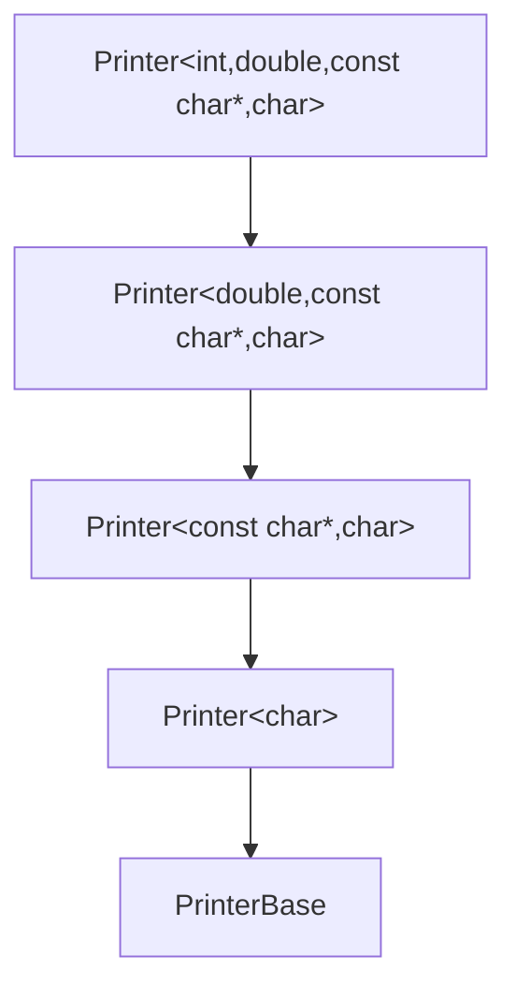
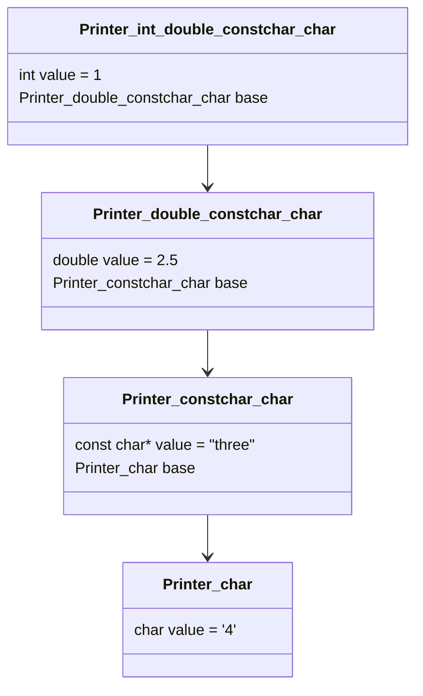

C++ 学习笔记 —— 模板

# 参数包展开
参数包的展开（Parameter Pack Expansion）是 C++11 引入的一种语法机制，用于处理可变参数模板中的参数包（parameter pack）。参数包是一个可以包含任意数量和类型的参数的集合，而参数包的展开则是将这些参数逐个传递给其他函数或操作。

参数包展开是 C++11 引入的可变参数模板的核心语法，它允许在编译时处理任意数量和类型的参数。这种语法是泛型编程的重要基础，也是现代 C++ 元编程的关键技术。

在 C++ 中，参数包是通过模板参数列表中的 `typename...` 或 `class...` 定义的。例如：

```cpp
template <typename... Args> // 声明模板参数包
void func(Args... args)     // 声明函数参数包
{
    // 函数体
}
```

- `typename... Args`: 声明一个模板参数包，可以接受任意数量的类型参数
- `Args... args`: 实例化了参数包 args，用于接收调用时传递的参数
- 模板参数列表中的 typename... Args 和函数参数列表中的 Args... args 是同一个参数包的不同表示。它们必须使用相同的名称，以便编译器能够正确地关联它们。
- 在可变参数模板中，**参数类型不需要都是相同的**。这是可变参数模板的核心优势之一——它能够处理任意类型、任意数量的参数。让我详细解释这一点。
- 每个参数都可以有自己独立的类型，编译器会为每个调用实例化适当的函数版本。

参数包展开的基本形式是在参数包名称后添加 `...`：

```cpp
func(args...); // 展开函数参数包
```

这等价于逐个传递参数：`func(arg1, arg2, arg3, ...);`

参数包的展开可以用于以下几种场景：
1. **递归调用**：将参数包中的每个参数逐个传递给递归调用。
2. **初始化列表**：将参数包中的每个参数逐个传递给初始化列表。
3. **函数调用**：将参数包中的每个参数逐个传递给其他函数。
4. **操作符展开**：将参数包中的每个参数逐个应用到某个操作符。

可变参数模板的设计允许处理**异构类型集合**，这是它与普通模板函数的关键区别：

1. **类型安全**：每个参数保持自己的类型信息
2. **灵活性**：可以处理任意类型组合
3. **效率**：避免不必要的类型转换
4. **精确控制**：保留原始类型信息

## 递归函数展开

```cpp
#include <iostream>

// 递归终止函数
void print() {
    std::cout << std::endl;
}

// 可变参数模板
template <typename T, typename... Args>
void print(T first, Args... args) {
    std::cout << first;
    if (sizeof...(args) > 0) { // sizeof... 获取参数包大小
        std::cout << ", ";
    }
    print(args...); // 递归展开
}

int main() {
    print(1, 2.5, "three", '4'); // 输出: 1, 2.5, three, 4
    return 0;
}
```

### 步骤1：第一次调用
```cpp
print<int, double, const char*, char>(1, 2.5, "three", '4');
```
- 参数包：`Args...` 包含 `double, const char*, char`
- `sizeof...(args)` = 3 > 0 → 输出 "1, "
- 递归调用：`print(2.5, "three", '4')`

### 步骤2：第二次调用
```cpp
print<double, const char*, char>(2.5, "three", '4');
```
- 参数包：`Args...` 包含 `const char*, char`
- `sizeof...(args)` = 2 > 0 → 输出 "2.5, "
- 递归调用：`print("three", '4')`

### 步骤3：第三次调用
```cpp
print<const char*, char>("three", '4');
```
- 参数包：`Args...` 包含 `char`
- `sizeof...(args)` = 1 > 0 → 输出 "three, "
- 递归调用：`print('4')`

### 步骤4：第四次调用
```cpp
print<char>('4');
```
- 参数包：`Args...` 为空
- `sizeof...(args)` = 0 → 不输出分隔符
- 递归调用：`print()` 

### 步骤5：调用终止函数
```cpp
void print() {
    std::cout << std::endl; // 输出换行
}
```

### 递归终止的关键点

1. **参数包耗尽时调用终止函数**
   - 当参数包被完全展开（变为空包）时
   - 最终会调用无参数的 `print()` 函数

2. **递归调用链**
   ```
   print(1, 2.5, "three", '4')
   → print(2.5, "three", '4')
   → print("three", '4')
   → print('4')        // 注意：这里仍然调用的是模板函数
   → print()           // 这里调用终止函数
   ```

3. **`print('4')` 的特殊性**
   - 当只有一个参数时，仍然调用模板函数
   - 在模板函数内部调用 `print(args...)` 时参数包为空
   - 因此调用无参数的 `print()` 终止函数

### 递归终止函数的必要性

如果移除终止函数，当调用 `print('4')` 时：
1. 输出 `'4'`
2. `sizeof...(args)` = 0 → 不输出分隔符
3. 调用 `print()` → **编译错误！**
   - 没有匹配的 `print()` 函数
   - 编译器找不到无参数版本的 `print`

### 完整的递归终止方案

#### 方案1：无参数终止函数（基础方案）
```cpp
void print() {
    std::cout << std::endl;
}
```

#### 方案2：单参数终止函数（替代方案）
```cpp
template <typename T>
void print(T last) {
    std::cout << last << std::endl;
}
```

使用单参数终止函数时的调用链：
```
print(1, 2.5, "three", '4')
→ print(2.5, "three", '4')
→ print("three", '4')
→ print('4') // 调用单参数终止函数
```

#### 方案3：C++17 的 `if constexpr`（无需终止函数）
```cpp
template <typename T, typename... Args>
void print(T first, Args... args) {
    std::cout << first;
    
    if constexpr (sizeof...(args) > 0) {
        std::cout << ", ";
        print(args...); // 只在有参数时递归
    } else {
        std::cout << std::endl;
    }
}
```

## 初始化列表展开

```cpp
#include <iostream>

template <typename... Args>
void print(Args... args) {
    // 使用初始化列表和逗号操作符展开
    int dummy[] = { (std::cout << args << " ", 0)... };
    (void)dummy; // 避免未使用变量警告
    std::cout << std::endl;
}

int main() {
    print(1, 2.5, "three", '4'); // 输出: 1 2.5 three 4 
    return 0;
}
```

### 初始化列表中参数包语法
```cpp
{ (expression_using_pack) ... }
```

关键组成部分：
1. **圆括号 `()`**：定义包含参数包的表达式
2. **参数包标识符**：如 `args`
3. **三个点 `...`**：展开操作符
4. **大括号 `{}`**：初始化列表上下文


基本形式：
```cpp
( pattern ) ...
```
- **pattern**：包含参数包的表达式
- **`...`**：展开操作符，表示对参数包中每个元素重复 pattern

在初始化列表中的使用：
```cpp
{ (std::cout << args << " ", 0)... }
```

这表示：
> 对参数包 `args` 中的每个元素，执行表达式  
> `(std::cout << [元素] << " ", 0)`

### 1. 模式定义
```cpp
(std::cout << args << " ", 0)
```

这是一个逗号表达式：
- 第一部分：`std::cout << args << " "`（输出操作）
- 第二部分：`0`（结果值）
- 整个表达式的结果是第二部分的值（0）

### 2. 展开操作符 `...`

`...` 操作符告诉编译器：
> 对参数包中的每个元素，复制整个模式，  
> 并将模式中的参数包替换为当前元素

### 3. 完整展开过程

假设参数包 `args` 包含三个元素：`a, b, c`

```cpp
{ (std::cout << args << " ", 0)... }
```

展开为：

```cpp
{
    (std::cout << a << " ", 0),  // 模式复制，args替换为a
    (std::cout << b << " ", 0),  // 模式复制，args替换为b
    (std::cout << c << " ", 0)   // 模式复制，args替换为c
}
```

### C++17 改进：折叠表达式

C++17 引入了更简洁的折叠表达式：

```cpp
template <typename... Args>
void print(Args... args) {
    (std::cout << ... << args) << "\n"; // 折叠表达式
}
```

比较：
| 特性       | 初始化列表展开 (C++11) | 折叠表达式 (C++17)       |
| ---------- | ---------------------- | ------------------------ |
| 语法复杂度 | 较高                   | 较低                     |
| 可读性     | 需要理解技巧           | 更直观                   |
| 性能       | 相同                   | 相同                     |
| 灵活性     | 较高（可包含复杂逻辑） | 有限（主要针对二元操作） |
| 分隔符支持 | 需要额外处理           | 需要额外处理             |
| 编译时间   | 可能较长               | 通常较短                 |

### (void)dummy 作用

在 C++ 中，如果你定义了一个变量但没有使用它，编译器会发出警告，提示该变量未被使用。为了避免这种警告，可以使用 `(void)` 将变量强制转换为 `void` 类型。这种转换不会产生任何副作用，但可以告诉编译器这个变量是故意未使用的。

**示例：**
```cpp
int unused_variable = 42;
(void)unused_variable; // 避免未使用变量警告
```

在 `print` 函数中，`dummy` 数组是一个临时变量，用于展开参数包并输出参数。由于 `dummy` 数组在函数中没有其他用途，为了避免编译器发出“未使用变量”的警告，使用 `(void)dummy;`。

## 模板参数展开

```cpp
#include <iostream>
#include <typeinfo>

// 类型信息打印
template <typename... Args>
void printTypes() {
    // 展开模板参数包
    int dummy[] = { (std::cout << typeid(Args).name() << " ", 0)... };
    (void)dummy;
    std::cout << std::endl;
}

int main() {
    printTypes<int, double, char, std::string>();
    // 输出: i d c NSt7__cxx1112basic_stringIcSt11char_traitsIcESaIcEEE 
    return 0;
}
```

`printTypes` 函数的目标是打印出模板参数包 `Args` 中每个类型的名称。这里的重点是 **模板参数**，而不是函数的实际参数。

### 模板参数 vs 函数参数

在 C++ 中，模板参数和函数参数是两个不同的概念：

- **模板参数**：用于定义模板的类型或值，它们在编译时被确定。
- **函数参数**：用于传递给函数的实际值，它们在运行时被确定。

### 模板参数包 `Args`
- `typename... Args` 是一个模板参数包，表示函数模板可以接受任意数量和类型的模板参数。
- 这些模板参数在编译时被确定，例如在调用 `printTypes<int, double, char, std::string>()` 时，`Args` 被实例化为 `int, double, char, std::string`。

### 函数参数为空
- `printTypes` 函数的定义中没有函数参数，因为它的目标是处理模板参数，而不是函数的实际参数。
- 函数参数通常用于传递运行时的值，而模板参数用于传递编译时的类型或值。

在 `printTypes` 函数中，我们不需要传递任何运行时的值，因为我们只关心模板参数的类型。模板参数的类型在编译时已经确定，因此不需要通过函数参数传递任何值。

### 展开过程

1. **模板参数包 `Args`**：
   - `Args` 被实例化为 `int, double, char, std::string`。

2. **展开参数包**：
   ```cpp
   int dummy[] = { (std::cout << typeid(Args).name() << " ", 0)... };
   ```
   - 展开后：
     ```cpp
     int dummy[] = { 
         (std::cout << typeid(int).name() << " ", 0), 
         (std::cout << typeid(double).name() << " ", 0), 
         (std::cout << typeid(char).name() << " ", 0), 
         (std::cout << typeid(std::string).name() << " ", 0) 
     };
     ```

   - 每个表达式 `(std::cout << typeid(Args).name() << " ", 0)` 的值是 `0`，但副作用是将类型名称输出到 `std::cout`。

## 继承展开

```cpp
#include <iostream>

// 递归基类
struct PrinterBase {};

// 递归继承模板
template <typename T, typename... Args>
struct Printer : Printer<Args...> {
    Printer(T value, Args... args) 
        : Printer<Args...>(args...), value(value) {}
    
    void print() {
        std::cout << value << " ";
        Printer<Args...>::print();
    }
    
    T value;
};

// 终止特化
template <typename T>
struct Printer<T> : PrinterBase {
    Printer(T value) : value(value) {}
    
    void print() {
        std::cout << value << std::endl;
    }
    
    T value;
};

int main() {
    Printer<int, double, const char*, char> printer(1, 2.5, "three", '4');
    printer.print(); // 输出: 1 2.5 three 4
    return 0;
}
```

这段代码展示了一种使用递归继承来处理可变参数模板的高级技术。它通过递归继承链和模板特化实现了对任意数量和类型参数的顺序处理。

### 1. 递归继承链



每个 `Printer` 类：
- 处理第一个类型 `T`
- 继承自处理剩余类型的 `Printer<Args...>`
- 形成递归继承链

### 2. 构造函数递归

```cpp
Printer(T value, Args... args) 
    : Printer<Args...>(args...), // 递归构造基类
      value(value) {}
```

参数传递过程：
1. `Printer<int, double, const char*, char>` 接收 `(1, 2.5, "three", '4')`
   - 保存 `value = 1`
   - 传递 `(2.5, "three", '4')` 给基类构造函数
2. `Printer<double, const char*, char>` 接收 `(2.5, "three", '4')`
   - 保存 `value = 2.5`
   - 传递 `("three", '4')` 给基类
3. 继续传递，直到终止特化

### 3. 打印方法递归

```cpp
void print() {
    std::cout << value << " ";   // 当前值
    Printer<Args...>::print();   // 递归基类
}
```

调用顺序：
1. 最外层 `print()` 输出第一个值
2. 调用基类 `print()` 输出下一个值
3. 递归直到终止特化

### 4. 终止特化

```cpp
template <typename T>
struct Printer<T> : PrinterBase {
    void print() {
        std::cout << value << std::endl; // 最后值 + 换行
    }
};
```

- 处理参数包中最后一个类型
- 结束递归链
- 输出最后的值并换行

### 实例化过程详解

当创建：
```cpp
Printer<int, double, const char*, char> printer(1, 2.5, "three", '4');
```

#### 步骤1：模板实例化

编译器生成类层次：
```cpp
Printer<int, double, const char*, char>
  : Printer<double, const char*, char>
    : Printer<const char*, char>
      : Printer<char>
        : PrinterBase
```

#### 步骤2：内存布局



#### 步骤3：构造函数调用链

1. `Printer<char>('4')` 被调用（终止特化）
2. `Printer<const char*, char>("three", '4')` 调用基类构造函数
3. `Printer<double, const char*, char>(2.5, "three", '4')` 调用基类
4. 最外层 `Printer<int,...>(1, ...)` 完成构造

#### 步骤4：print() 调用链

```cpp
printer.print();
```

执行顺序：
1. 最外层 `print()`: 输出 `1 ` + 调用基类 `print()`
2. 第二层 `print()`: 输出 `2.5 ` + 调用基类 `print()`
3. 第三层 `print()`: 输出 `three ` + 调用基类 `print()`
4. 最内层 `print()`: 输出 `4\n`

### 设计优势与特点

#### 1. 编译时递归解析
- 所有类型信息在编译时确定
- 无运行时类型检查开销

#### 2. 值存储与类型绑定
- 每个值存储在对应类型的类中
- 类型安全的值访问

#### 3. 顺序保证
- 参数处理顺序与声明顺序一致
- 继承链确保顺序不变

#### 4. 零虚函数开销
- 不使用虚函数或运行时多态
- 所有调用静态绑定

#### 5. 内存高效
- 无额外包装开销
- 值直接存储在对应类中

### 与传统递归对比

| 特性     | 递归继承   | 函数递归          |
| -------- | ---------- | ----------------- |
| 实现方式 | 类继承链   | 函数调用栈        |
| 值存储   | 类成员变量 | 函数参数/局部变量 |
| 内存位置 | 分散存储   | 连续栈帧          |
| 调用开销 | 静态绑定   | 函数调用开销      |
| 适用场景 | 需要存储值 | 仅处理不存储      |
| 调试难度 | 较复杂     | 较简单            |

## 函数调用展开

```cpp
#include <iostream>
#include <functional>

void customPrint(int value) {
    std::cout << "Int: " << value << "\n";
}

void customPrint(double value) {
    std::cout << "Double: " << value << "\n";
}

void customPrint(const char* value) {
    std::cout << "String: " << value << "\n";
}

// 应用函数到每个参数
template <typename... Args>
void applyToEach(void (*func)(Args...), Args... args) {
    // 使用初始化列表展开
    int dummy[] = { (func(args), 0)... };
    (void)dummy;
}

int main() {
    applyToEach(customPrint, 42, 3.14, "Hello");
    /* 输出:
       Int: 42
       Double: 3.14
       String: Hello */
    return 0;
}
```

## 完美转发展开

```cpp
#include <iostream>
#include <utility>

class Logger {
public:
    Logger(const std::string& name, int id) 
        : name(name), id(id) {
        std::cout << "Created: " << name << " (" << id << ")\n";
    }
    
    Logger(const Logger& other) 
        : name(other.name), id(other.id) {
        std::cout << "Copied: " << name << " (" << id << ")\n";
    }
    
    Logger(Logger&& other) noexcept 
        : name(std::move(other.name)), id(other.id) {
        std::cout << "Moved: " << name << " (" << id << ")\n";
    }
};

// 完美转发工厂
template <typename T, typename... Args>
T createInstance(Args&&... args) {
    return T(std::forward<Args>(args)...);
}

int main() {
    // 直接构造
    auto logger1 = createInstance<Logger>("Logger1", 100);
    
    // 移动构造
    std::string name = "Logger2";
    auto logger2 = createInstance<Logger>(std::move(name), 200);
    
    // 拷贝构造
    auto logger3 = createInstance<Logger>(logger1);
    
    return 0;
}
```

## 参数包展开的复杂模式

### 1. 带操作的展开

```cpp
#include <iostream>
#include <string>

template <typename... Args>
void printWithPrefix(const std::string& prefix, Args... args) {
    // 带操作的展开: 为每个参数添加前缀
    int dummy[] = { (std::cout << prefix << args << " ", 0)... };
    (void)dummy;
    std::cout << std::endl;
}

int main() {
    printWithPrefix("[INFO] ", 1, 2.5, "three", '4');
    // 输出: [INFO] 1 [INFO] 2.5 [INFO] three [INFO] 4 
    return 0;
}
```

### 2. 嵌套参数包展开

```cpp
#include <iostream>

// 内部函数
void processElement(int value) {
    std::cout << "Processing int: " << value << "\n";
}

void processElement(double value) {
    std::cout << "Processing double: " << value << "\n";
}

void processElement(const char* value) {
    std::cout << "Processing string: " << value << "\n";
}

// 外层可变参数模板
template <typename... Args>
void processAll(Args... args) {
    // 嵌套展开：对每个参数调用processElement
    int dummy[] = { (processElement(args), 0)... };
    (void)dummy;
}

int main() {
    processAll(42, 3.14, "Hello");
    /* 输出:
       Processing int: 42
       Processing double: 3.14
       Processing string: Hello */
    return 0;
}
```

### 3. 编译时条件展开

```cpp
#include <iostream>
#include <type_traits>

// 条件处理函数
template <typename T>
void processIfNumeric(T value) {
    if constexpr (std::is_arithmetic_v<T>) {
        std::cout << "Numeric: " << value << "\n";
    } else {
        std::cout << "Non-numeric: " << value << "\n";
    }
}

// 带条件的参数包展开
template <typename... Args>
void processWithCondition(Args... args) {
    int dummy[] = { (processIfNumeric(args), 0)... };
    (void)dummy;
}

int main() {
    processWithCondition(42, "Hello", 3.14, 'A');
    /* 输出:
       Numeric: 42
       Non-numeric: Hello
       Numeric: 3.14
       Numeric: A */
    return 0;
}
```

## 高级应用：编译时计算

### 1. 编译时参数包处理

```cpp
#include <iostream>
#include <type_traits>

// 计算参数包中数值的总和
template <int... Values>
struct Sum {
    static constexpr int value = (Values + ...);
};

// 检查参数包中是否包含特定类型
template <typename T, typename... Args>
struct Contains {
    static constexpr bool value = (std::is_same_v<T, Args> || ...);
};

// 获取参数包中最大整数
template <int First, int... Rest>
struct Max {
    static constexpr int value = First > Max<Rest...>::value ? 
        First : Max<Rest...>::value;
};

// 终止递归
template <int Last>
struct Max<Last> {
    static constexpr int value = Last;
};

int main() {
    std::cout << "Sum: " << Sum<1, 2, 3, 4, 5>::value << "\n"; // 15
    std::cout << "Contains int: " 
              << std::boolalpha 
              << Contains<int, double, char, int>::value << "\n"; // true
    std::cout << "Max: " << Max<7, 2, 9, 4, 5>::value << "\n"; // 9
    return 0;
}
```

### 2. 编译时字符串处理

```cpp
#include <iostream>
#include <array>

// 编译时字符串连接
template <typename... Strings>
class Concatenator {
    static constexpr size_t calculateTotalSize() {
        return (0 + ... + Strings::size());
    }
    
public:
    static constexpr auto concatenate() {
        std::array<char, calculateTotalSize() + 1> result{};
        size_t index = 0;
        
        // 展开每个字符串的字符
        (([](auto& res, size_t& idx, const auto& str) {
            for (size_t i = 0; i < str.size(); ++i) {
                res[idx++] = str.data[i];
            }
        }(result, index, Strings{})), ...);
        
        result[index] = '\0';
        return result;
    }
};

// 编译时字符串字面量包装
template <size_t N>
struct ConstString {
    constexpr ConstString(const char (&str)[N]) {
        for (size_t i = 0; i < N; ++i) {
            data[i] = str[i];
        }
    }
    
    char data[N];
    static constexpr size_t size() { return N - 1; } // 不包括终止符
};

int main() {
    // 编译时连接字符串
    constexpr auto result = Concatenator<
        ConstString<6>, // "Hello"
        ConstString<7>, // " World"
        ConstString<2>  // "!"
    >::concatenate();
    
    std::cout << result.data() << "\n"; // 输出: Hello World!
    return 0;
}
```

## 常见问题与解决方案

### 问题1：递归终止函数不匹配

**解决方案**：确保所有参数组合都有匹配的函数

```cpp
// 终止函数
void process() {}

// 单参数版本
template <typename T>
void process(T last) {
    std::cout << last << "\n";
}

// 可变参数版本
template <typename T, typename... Args>
void process(T first, Args... args) {
    std::cout << first << ", ";
    process(args...);
}
```

### 问题2：参数包为空时的处理

**解决方案**：使用条件编译或特化

```cpp
template <typename... Args>
void safeProcess(Args... args) {
    if constexpr (sizeof...(args) > 0) {
        // 处理参数
        int dummy[] = { (processSingle(args), 0)... };
        (void)dummy;
    } else {
        std::cout << "No arguments\n";
    }
}
```

### 问题3：保留参数包的引用类型

**解决方案**：使用完美转发

```cpp
template <typename... Args>
void forwarder(Args&&... args) {
    target(std::forward<Args>(args)...);
}
```

## 参数包展开的最佳实践

1. **优先使用递归展开**：可读性好，易于理解
2. **复杂操作使用初始化列表**：避免深度递归
3. **使用 `sizeof...` 获取参数数量**：编译时获取信息
4. **完美转发保持值类别**：使用 `std::forward` 保持引用类型
5. **编译时计算利用折叠表达式**（C++17）
6. **避免深度递归**：超过100层可能导致编译器问题

参数包展开是 C++ 模板元编程的核心技术，它提供了处理任意数量和类型参数的能力，是现代 C++ 泛型编程的基础。掌握参数包展开技术对于编写灵活、通用的库代码至关重要。

# 函数模板

模板是 C++ 中实现泛型编程的核心机制，允许开发者编写与数据类型无关的通用代码。模板通过参数化类型实现了代码复用，是 STL（标准模板库）的基础。

函数模板是C++中实现泛型编程的一种方式，它允许编写一个函数，这个函数可以处理不同类型的参数。函数模板提供了一种方式来定义通用算法，这些算法可以用于不同的数据类型，而不需要为每种数据类型编写单独的函数。

## 1. 基本函数模板

```cpp
#include <iostream>

// 基本函数模板
template <typename T>
T max(T a, T b) {
    return (a > b) ? a : b;
}

// 多类型参数模板
template <typename T1, typename T2>
void printPair(T1 first, T2 second) {
    std::cout << "(" << first << ", " << second << ")\n";
}

int main() {
    // 使用模板
    std::cout << "max(3, 5) = " << max(3, 5) << "\n";
    std::cout << "max(3.2, 2.9) = " << max(3.2, 2.9) << "\n";
    
    // 显式指定类型
    std::cout << "max<double>(3, 5.5) = " << max<double>(3, 5.5) << "\n";
    
    // 多类型参数
    printPair(10, "Hello");
    printPair(3.14, true);
    
    return 0;
}
```

## 2. 函数模板重载
模板重载是指在同一个作用域内定义多个同名的函数模板，这些模板的参数列表不同（通常是参数的类型或数量不同）。编译器会根据调用时提供的参数类型和数量来决定使用哪个重载版本。
重载的主要目的是提供多个同名函数的不同实现，以适应不同的参数类型或数量。

```cpp
#include <iostream>
#include <cstring>

// 通用模板
template <typename T>
void print(T value) {
    std::cout << "Generic: " << value << "\n";
}

// 指针特化重载
template <typename T>
void print(T* ptr) {
    std::cout << "Pointer: " << *ptr << "\n";
}

// 数组特化重载
template <typename T, size_t N>
void print(T (&arr)[N]) {
    std::cout << "Array[" << N << "]: ";
    for (size_t i = 0; i < N; ++i) {
        std::cout << arr[i] << " ";
    }
    std::cout << "\n";
}

// 字符串字面量特化
template <size_t N>
void print(const char (&str)[N]) {
    std::cout << "String literal: " << str << " (length: " << N-1 << ")\n";
}

int main() {
    int x = 42;
    int arr[] = {1, 2, 3, 4, 5};
    const char* str = "Dynamic string";
    
    print(10);          // 通用模板
    print(3.14);        // 通用模板
    print(&x);          // 指针重载
    print(arr);         // 数组重载
    print("Hello");     // 字符串字面量重载
    print(str);         // 指针重载 (const char*)
    
    return 0;
}
```

## 3. 函数模板特化
函数模板特化是指为函数模板的特定类型参数提供定制化的实现。特化可以是完全特化（完全指定所有模板参数）或部分特化（只指定部分模板参数）。
完全特化：为所有模板参数提供具体的类型。
部分特化：只对部分模板参数提供具体的类型，其他参数保持为模板参数。
特化的主要目的是为特定的类型组合提供优化或定制化的实现。

```cpp
#include <iostream>
#include <cstring>

// 主模板
template <typename T>
bool isEqual(T a, T b) {
    std::cout << "Using generic comparison\n";
    return a == b;
}

// 全特化：针对const char*
template <>
bool isEqual<const char*>(const char* a, const char* b) {
    std::cout << "Using string comparison\n";
    return strcmp(a, b) == 0;
}

// 部分特化：针对指针类型
template <typename T>
bool isEqual(T* a, T* b) {
    std::cout << "Using pointer comparison\n";
    return *a == *b;
}

int main() {
    int a = 5, b = 5;
    const char* s1 = "hello";
    const char* s2 = "world";
    const char* s3 = "hello";
    
    std::cout << std::boolalpha;
    std::cout << "isEqual(a, b): " << isEqual(a, b) << "\n";
    std::cout << "isEqual(s1, s2): " << isEqual(s1, s2) << "\n";
    std::cout << "isEqual(s1, s3): " << isEqual(s1, s3) << "\n";
    
    int x = 10, y = 10;
    std::cout << "isEqual(&x, &y): " << isEqual(&x, &y) << "\n";
    std::cout << "isEqual(&x, &x): " << isEqual(&x, &x) << "\n";
    
    return 0;
}
```

## 4. 可变参数函数模板 (Variadic Templates)

```cpp
#include <iostream>
#include <string>

// 递归终止函数
void print() {
    std::cout << "\n";
}

// 可变参数模板
template <typename T, typename... Args>
void print(T first, Args... args) {
    std::cout << first;
    if (sizeof...(args) > 0) {
        std::cout << ", ";
    }
    print(args...); // 递归调用
}

// 使用折叠表达式 (C++17)
template <typename... Args>
void printFold(Args... args) {
    (std::cout << ... << args) << "\n";
}

// 带分隔符的折叠表达式
template <typename... Args>
void printWithSeparator(Args... args) {
    ((std::cout << args << " "), ...) << "\n";
}

// 计算可变参数的和
template <typename T>
T sum(T value) {
    return value;
}

template <typename T, typename... Args>
T sum(T first, Args... args) {
    return first + sum(args...);
}

// 使用折叠表达式的求和 (C++17)
template <typename... Args>
auto sumFold(Args... args) {
    return (args + ...);
}

int main() {
    // 递归可变参数
    print(1, 2.5, "three", '4');
    
    // 折叠表达式
    printFold(5, " apples");
    printWithSeparator("A", "B", "C", "D");
    
    // 求和函数
    std::cout << "sum(1, 2, 3, 4, 5) = " << sum(1, 2, 3, 4, 5) << "\n";
    std::cout << "sumFold(1.1, 2.2, 3.3) = " << sumFold(1.1, 2.2, 3.3) << "\n";
    
    return 0;
}
```

## 5. 返回类型推导

### 5.1 使用 `auto` 和 `decltype`

```cpp
#include <iostream>
#include <vector>

// 使用尾置返回类型
template <typename T1, typename T2>
auto add(T1 a, T2 b) -> decltype(a + b) {
    return a + b;
}

// 使用 decltype(auto) (C++14)
template <typename Container>
decltype(auto) getFirstElement(Container&& c) {
    return c[0];
}

// 使用 auto 返回类型推导 (C++14)
template <typename T, typename U>
auto multiply(T a, U b) {
    return a * b;
}

int main() {
    // 不同类型相加
    auto result1 = add(3, 4.5);
    std::cout << "add(3, 4.5) = " << result1 << " (type: " << typeid(result1).name() << ")\n";
    
    // 容器元素访问
    std::vector<int> vec = {10, 20, 30};
    auto& first = getFirstElement(vec);
    first = 100;
    std::cout << "First element: " << vec[0] << "\n";
    
    // 乘法
    auto result2 = multiply(2.5, 4);
    std::cout << "multiply(2.5, 4) = " << result2 << " (type: " << typeid(result2).name() << ")\n";
    
    return 0;
}
```

### 5.2 `std::common_type` 处理不同类型

```cpp
#include <iostream>
#include <type_traits>

template <typename T1, typename T2>
typename std::common_type<T1, T2>::type safeDivide(T1 a, T2 b) {
    if (b == 0) {
        throw std::runtime_error("Division by zero");
    }
    return static_cast<typename std::common_type<T1, T2>::type>(a) / b;
}

int main() {
    try {
        auto result1 = safeDivide(10, 3);
        std::cout << "10 / 3 = " << result1 << " (type: " << typeid(result1).name() << ")\n";
        
        auto result2 = safeDivide(7.5, 2);
        std::cout << "7.5 / 2 = " << result2 << " (type: " << typeid(result2).name() << ")\n";
        
        auto result3 = safeDivide(10, 0); // 抛出异常
    } catch (const std::exception& e) {
        std::cerr << "Error: " << e.what() << "\n";
    }
    
    return 0;
}
```

## 6. 完美转发 (Perfect Forwarding)

```cpp
#include <iostream>
#include <utility>
#include <string>

class Resource {
public:
    Resource() { std::cout << "Default constructor\n"; }
    Resource(const Resource&) { std::cout << "Copy constructor\n"; }
    Resource(Resource&&) noexcept { std::cout << "Move constructor\n"; }
    Resource(int, double) { std::cout << "Parameterized constructor\n"; }
};

// 完美转发函数模板
template <typename T, typename... Args>
T createResource(Args&&... args) {
    return T(std::forward<Args>(args)...);
}

// 包装器函数
template <typename Func, typename... Args>
auto callFunction(Func&& func, Args&&... args) 
    -> decltype(func(std::forward<Args>(args)...)) 
{
    return func(std::forward<Args>(args)...);
}

// 示例函数
int add(int a, int b) {
    return a + b;
}

std::string concat(const std::string& a, const std::string& b) {
    return a + b;
}

int main() {
    std::cout << "Creating resources:\n";
    Resource r1 = createResource<Resource>(); // 默认构造
    Resource r2 = createResource<Resource>(r1); // 拷贝构造
    Resource r3 = createResource<Resource>(std::move(r2)); // 移动构造
    Resource r4 = createResource<Resource>(10, 3.14); // 参数化构造
    
    std::cout << "\nCalling functions:\n";
    int sum = callFunction(add, 5, 7);
    std::cout << "Sum: " << sum << "\n";
    
    std::string result = callFunction(concat, "Hello, ", "World!");
    std::cout << "Concat: " << result << "\n";
    
    return 0;
}
```

## 7. SFINAE (Substitution Failure Is Not An Error)

```cpp
#include <iostream>
#include <type_traits>
#include <vector>

// 使用 enable_if
template <typename T>
typename std::enable_if<std::is_integral<T>::value, T>::type
increment(T value) {
    return value + 1;
}

template <typename T>
typename std::enable_if<std::is_floating_point<T>::value, T>::type
increment(T value) {
    return value + 0.5;
}

// 使用表达式 SFINAE
template <typename T>
auto hasSizeMethod(const T& obj) -> decltype(obj.size(), bool()) {
    std::cout << "Has size() method: ";
    return true;
}

bool hasSizeMethod(...) {
    std::cout << "No size() method: ";
    return false;
}

// 概念风格的 SFINAE (C++11)
template <typename T>
class IsContainer {
    typedef char yes[1];
    typedef char no[2];
    
    template <typename C> static yes& test(decltype(&C::size), decltype(&C::begin), decltype(&C::end));
    template <typename> static no& test(...);
    
public:
    static const bool value = sizeof(test<T>(nullptr, nullptr, nullptr)) == sizeof(yes);
};

template <typename T>
typename std::enable_if<IsContainer<T>::value>::type
printContainer(const T& container) {
    std::cout << "Container elements: ";
    for (const auto& item : container) {
        std::cout << item << " ";
    }
    std::cout << "\n";
}

template <typename T>
typename std::enable_if<!IsContainer<T>::value>::type
printContainer(const T& value) {
    std::cout << "Single value: " << value << "\n";
}

int main() {
    // SFINAE 函数重载
    std::cout << "increment(5) = " << increment(5) << "\n";
    std::cout << "increment(3.14) = " << increment(3.14) << "\n";
    
    // 检测方法存在
    std::vector<int> vec = {1, 2, 3};
    int x = 42;
    
    std::cout << hasSizeMethod(vec) << "\n";
    std::cout << hasSizeMethod(x) << "\n";
    
    // 容器检测
    printContainer(vec);
    printContainer(x);
    
    return 0;
}
```

## 8. 概念约束 (C++20)

```cpp
#include <iostream>
#include <concepts>
#include <vector>
#include <string>

// 自定义概念
template <typename T>
concept Numeric = std::integral<T> || std::floating_point<T>;

template <typename T>
concept Printable = requires(T t) {
    { std::cout << t } -> std::same_as<std::ostream&>;
};

template <typename T>
concept Container = requires(T t) {
    t.size();
    t.begin();
    t.end();
    typename T::value_type;
};

// 使用概念的模板函数
template <Printable T>
void print(T value) {
    std::cout << value << "\n";
}

template <Numeric T>
T add(T a, T b) {
    return a + b;
}

// 约束的多种组合方式
template <typename T>
requires Container<T> && Printable<typename T::value_type>
void printContainer(const T& container) {
    std::cout << "[";
    for (auto it = container.begin(); it != container.end(); ++it) {
        std::cout << *it;
        if (std::next(it) != container.end()) {
            std::cout << ", ";
        }
    }
    std::cout << "]\n";
}

// 简写概念语法
void printNumber(Numeric auto num) {
    std::cout << "Number: " << num << "\n";
}

int main() {
    // 使用概念约束的函数
    print(42);
    print("Hello");
    
    std::cout << "add(5, 7) = " << add(5, 7) << "\n";
    std::cout << "add(3.14, 2.71) = " << add(3.14, 2.71) << "\n";
    
    // 打印容器
    std::vector<int> intVec = {1, 2, 3, 4, 5};
    std::vector<std::string> strVec = {"A", "B", "C"};
    
    printContainer(intVec);
    printContainer(strVec);
    
    // 简写语法
    printNumber(100);
    printNumber(3.14159);
    
    return 0;
}
```

## 9. 模板元编程示例

```cpp
#include <iostream>
#include <type_traits>

// 编译时阶乘计算
template <unsigned N>
constexpr unsigned factorial() {
    if constexpr (N == 0) {
        return 1;
    } else {
        return N * factorial<N - 1>();
    }
}

// 类型选择器
template <bool Condition, typename T, typename F>
struct Conditional {
    using type = T;
};

template <typename T, typename F>
struct Conditional<false, T, F> {
    using type = F;
};

// 编译时类型转换
template <typename T>
constexpr auto typeSize() {
    if constexpr (std::is_pointer_v<T>) {
        return sizeof(typename std::remove_pointer_t<T>);
    } else if constexpr (std::is_array_v<T>) {
        return sizeof(typename std::remove_extent_t<T>);
    } else {
        return sizeof(T);
    }
}

int main() {
    // 编译时计算
    constexpr auto fact5 = factorial<5>();
    std::cout << "5! = " << fact5 << "\n";
    
    // 类型选择
    using IntOrDouble = Conditional<(sizeof(int) > 4), int, double>::type;
    std::cout << "Selected type: " << typeid(IntOrDouble).name() 
              << " (size: " << sizeof(IntOrDouble) << ")\n";
    
    // 类型大小计算
    int x = 42;
    int arr[10];
    double* ptr = nullptr;
    
    std::cout << "typeSize<int>() = " << typeSize<int>() << "\n";
    std::cout << "typeSize<decltype(arr)>() = " << typeSize<decltype(arr)>() << "\n";
    std::cout << "typeSize<decltype(ptr)>() = " << typeSize<decltype(ptr)>() << "\n";
    
    return 0;
}
```

## 函数模板最佳实践

1. **命名约定**
   - 使用描述性类型参数名 (如 `InputIterator`, `OutputIterator`)
   - 避免单个字符名称，除非是简单数学操作

2. **约束和概念**
   - 使用 `static_assert` 或概念 (C++20) 提供清晰错误消息
   ```cpp
   template <typename T>
   void process(T value) {
       static_assert(std::is_arithmetic_v<T>, 
                    "T must be an arithmetic type");
       // ...
   }
   ```

3. **避免不必要的实例化**
   - 使用 `if constexpr` 避免无效代码路径
   ```cpp
   template <typename T>
   void handle(T value) {
       if constexpr (std::is_pointer_v<T>) {
           // 仅对指针类型有效
           *value = 42;
       } else {
           value = 42;
       }
   }
   ```

4. **类型别名**
   - 使用 `using` 简化复杂类型
   ```cpp
   template <typename T>
   using Pointer = T*;
   
   template <typename T>
   void process(Pointer<T> ptr) {
       // ...
   }
   ```

5. **性能考虑**
   - 小函数模板通常会被内联
   - 大型模板考虑显式实例化减少编译时间

6. **错误消息优化**
   - 使用 `static_assert` 提供友好错误提示
   - 概念 (C++20) 提供更清晰的约束失败消息

函数模板是 C++ 强大泛型编程能力的核心，合理使用可以创建高度可重用、类型安全且高效的代码。掌握各种模板技术是成为 C++ 高级开发者的关键步骤。

# 模板参数推导（Template Argument Deduction）
> [Template argument deduction - cppreference.com](https://en.cppreference.com/w/cpp/language/template_argument_deduction.html) 

在C++中，模板参数的类型是根据传入的参数自动推导的。这个过程称为**模板参数推导（Template Argument Deduction）**。

```cpp
template <typename T>
void forwardFunction(T&& arg) {
    process(std::forward<T>(arg)); // 完美转发
}
```

`std::forward` 是一个类型转换函数，用于保持参数的左值或右值属性不变。它的行为取决于模板参数 `T` 的类型：

- 如果 `T` 是左值引用类型（如 `int&`），`std::forward<T>(arg)` 会将 `arg` 转换为左值引用。
- 如果 `T` 是非引用类型（如 `int`），`std::forward<T>(arg)` 会将 `arg` 转换为右值引用。

## 引用折叠规则
C++11引入了引用折叠规则，用于处理右值引用的模板参数。引用折叠规则如下：

1. **左值引用到左值引用**：`T& &` 折叠为 `T&`。
2. **右值引用到左值引用**：`T&& &` 折叠为 `T&`。
3. **左值引用到右值引用**：`T& &&` 折叠为 `T&`。
4. **右值引用到右值引用**：`T&& &&` 折叠为 `T&&`。

## 模板参数推导与引用折叠
当调用 `forwardFunction` 时，模板参数 `T` 的类型会根据传入的参数自动推导。具体来说：

1. **传入左值**：
   - 如果传入的是左值（如变量 `x`），模板参数 `T` 会被推导为左值引用类型。
   - 例如，`forwardFunction(x)` 中，`x` 是左值，`T` 被推导为 `int&`。
   - 参数 `T&& arg` 会退化为左值引用 `int&`。

2. **传入右值**：
   - 如果传入的是右值（如字面量 `20`），模板参数 `T` 会被推导为非引用类型。
   - 例如，`forwardFunction(20)` 中，`20` 是右值，`T` 被推导为 `int`。
   - 参数 `T&& arg` 保持为右值引用 `int&&`。

## 左值引用到左值引用
```cpp
template <typename T>
void test(T& ref) {
    // do something
}

int main() {
    int x = 10;
    test(x); // T 被推导为 int，T& 是 int&
}
```
- `T` 被推导为 `int`，`T&` 是 `int&`。

## 右值引用到左值引用
```cpp
template <typename T>
void test(T& ref) {
    // do something
}

int main() {
    test(20); // T 被推导为 int，T& 是 int&
}
```
- `T` 被推导为 `int`，`T&` 是 `int&`。

## 左值引用到右值引用
```cpp
template <typename T>
void test(T&& ref) {
    // do something
}

int main() {
    int x = 10;
    test(x); // T 被推导为 int&，T&& 是 int&
}
```
- `T` 被推导为 `int&`，`T&&` 折叠为 `int&`。

## 右值引用到右值引用
```cpp
template <typename T>
void test(T&& ref) {
    // do something
}

int main() {
    test(20); // T 被推导为 int，T&& 是 int&&
}
```
- `T` 被推导为 `int`，`T&&` 是 `int&&`。

## 总结
- **模板参数推导**：模板参数 `T` 的类型是根据传入的参数自动推导的。
- **引用折叠规则**：`T&&` 的行为取决于 `T` 的类型。
  - 如果 `T` 是左值引用类型（如 `int&`），`T&&` 折叠为左值引用 `int&`。
  - 如果 `T` 是非引用类型（如 `int`），`T&&` 保持为右值引用 `int&&`。
- **`std::forward`**：用于保持参数的左值或右值属性不变。
  - 如果 `T` 是左值引用类型，`std::forward<T>(arg)` 保持左值属性。
  - 如果 `T` 是非引用类型，`std::forward<T>(arg)` 保持右值属性。

通过这些规则，`forwardFunction` 能够同时转发左值和右值，确保参数的类型和属性在转发过程中保持不变。